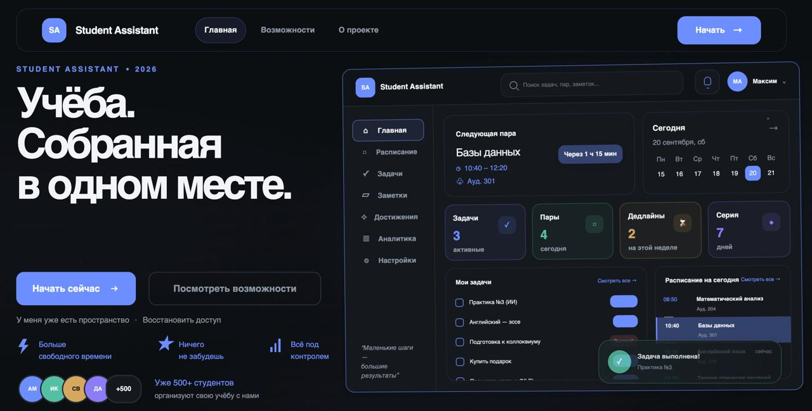

# Student Assistant

Умный студенческий планировщик для задач, расписания, заметок и дедлайнов.

[Live Demo](https://student-assistant-beby.onrender.com) · [Telegram Bot](https://t.me/student_assistant_max_bot) · [License](LICENSE)



## Возможности

- **Задачи и дедлайны** — приоритеты, сроки и повторяющиеся задачи.
- **Расписание** — учебные занятия и план на неделю.
- **Календарь** — задачи и занятия в одном представлении.
- **Заметки** — учебные материалы и личные записи.
- **Telegram-уведомления** — напоминания о дедлайнах и ежедневная сводка при настроенном боте.
- **Синхронизация устройств** — подключение телефона или компьютера через QR-код или одноразовый код.
- **Без email и пароля** — создание пространства и доступ с доверенного устройства.
- **Recovery key** — ключ восстановления доступа при потере устройств.

## Как это работает

1. Создаёшь пространство и сохраняешь ключ восстановления.
2. Добавляешь задачи и расписание.
3. Подключаешь телефон через QR-код или код из профиля.
4. Данные синхронизируются между устройствами в общем пространстве.

## Технологии

| Область | Технологии |
| --- | --- |
| Backend | Python, FastAPI, Jinja2 |
| База данных | PostgreSQL / SQLite |
| Интерфейс | JavaScript, HTML/CSS |
| Уведомления | Telegram Bot API |
| Развёртывание | Docker, Render |

## Быстрый запуск

Нужны Python 3.12+ и Git. Для локального запуска достаточно SQLite.

```bash
git clone https://github.com/Xelmor/student-assistant.git
cd student-assistant
python -m venv venv
source venv/bin/activate
pip install -r requirements.txt
python run.py
```

В Windows PowerShell вместо `source venv/bin/activate`:

```powershell
.\venv\Scripts\Activate.ps1
```

Приложение доступно по адресу [http://127.0.0.1:8000](http://127.0.0.1:8000).
Если команда `python` недоступна в Linux/macOS, используйте `python3`.

### Production-зависимости

`requirements.lock.txt` содержит только runtime-зависимости с точными версиями
и SHA-256-хешами. Цель — **Linux x86_64 (glibc), CPython 3.12**; это не
универсальный lock для Windows/macOS.

В отдельном окружении целевой платформы:

```bash
python -m pip install --require-hashes -r requirements.lock.txt
python -m pip check
```

Основной Dockerfile устанавливает этот production-lock с `--require-hashes`
и выполняет `pip check`. Job `production-image` проверяет именно основной образ,
его штатный запуск `python run.py` и HTTP-ответ через опубликованный порт.
[Проверки и повторная генерация lock](docs/DEPLOYMENT.md#dependency-installation-and-lock-regeneration).

### Docker

```bash
docker build --platform linux/amd64 -t student-assistant .
docker run --rm --env-file .env -e HOST=0.0.0.0 -p 127.0.0.1:8000:8000 student-assistant
```

`.env` передаётся при запуске и не входит в образ. Для постоянных данных используйте
PostgreSQL или отдельный volume SQLite. Режим развёртывания и настройки действующего
Render-сервиса этот переход не меняет.

## Переменные окружения

[.env.example](.env.example) содержит шаблон настроек. Для своей конфигурации
скопируйте его в `.env` и задайте нужные значения:

```bash
cp .env.example .env
```

В Windows PowerShell: `Copy-Item .env.example .env`.

Основные настройки: `DATABASE_URL`, `SECRET_KEY`, `APP_ENV`, `HOST` и `PORT`.
Для production также настройте `COOKIE_SECURE`, `ALLOWED_HOSTS` и `PUBLIC_BASE_URL`.
Telegram настраивается отдельно по инструкции ниже. Не публикуйте `.env`,
токены и ключи доступа.

## Структура проекта

```text
app/           — приложение, маршруты, шаблоны и статические файлы
telegram_bot/  — Telegram-интеграция и отправка уведомлений
tests/         — автоматические тесты и E2E-сценарии
docs/          — документация по запуску, тестированию и безопасности
scripts/       — вспомогательные скрипты запуска
```

## Тесты

Создайте отдельное тестовое окружение, не обновляя рабочий `venv`:

```bash
python3.12 -m venv /tmp/student-assistant-tests
source /tmp/student-assistant-tests/bin/activate
python -m pip install --require-hashes -r requirements.lock.txt
python -m pip install -r requirements-dev.txt
python -m pip check
```

`requirements-dev.txt` включает `requirements.constraints.txt`, автоматически
полученный из production-lock. Поэтому установка pytest/Playwright/httpx2
не может незаметно изменить закреплённые runtime-версии. Хеши проверяются
при отдельной установке lock; constraints содержат только версии.
На Windows/macOS совместимость нужно проверять отдельно.

Основной набор тестов:

```bash
pytest
```

Браузерные E2E-тесты запускаются отдельно:

```bash
python -m playwright install chromium
pytest tests/e2e
```

Команды выполняются из корня проекта с активированным виртуальным окружением.

## Документация

- [E2E-тестирование](docs/testing/E2E_TESTING.md)
- [Аудит безопасности](docs/security/SECURITY_AUDIT.md)
- [Настройка Telegram-бота](docs/integrations/TELEGRAM_BOT_SETUP.md)
- [Развёртывание и production](docs/DEPLOYMENT.md)

## License

[MIT License](LICENSE).
